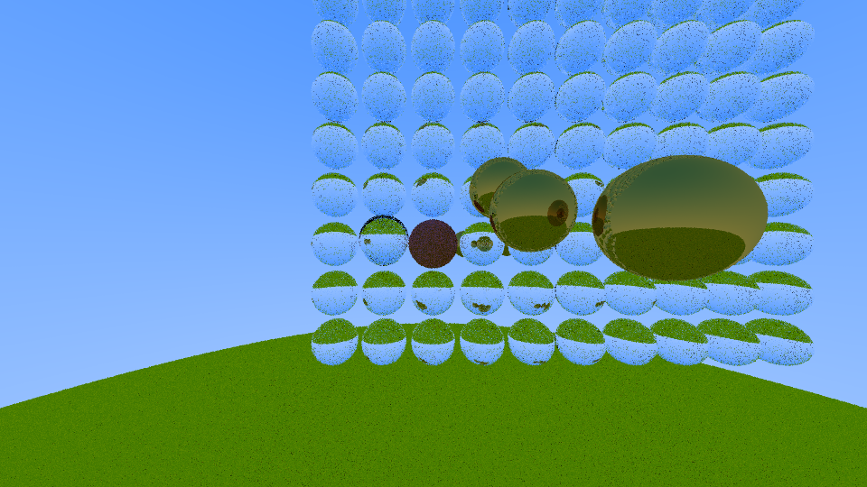

# ArtifactRT
A CPU Raytracer based on Peter Shirleys Ray Tracing in One Weekend that has been slightly iterated upon, primarily in terms of performance.

## Optimizations
The original implementation has been optimized on quite a bit. Making things linear in memory, non-virtual etc. is showcased through the test scene from the sample image.
Some superficial timings (measured on Intel i7-11800H with clang 19.1.5):

Original implementation runtime: ~79 seconds.

With optimizations (no BVH): ~1.4 seconds.

With multithreaded jobs on n-1 cores (no BVH): ~0.25 seconds;

## File formats
While the original tutorial only writes to PPM, I find it a painful format for viewer compatibility, so the output can also be written to png (as per the example) using libspng.
